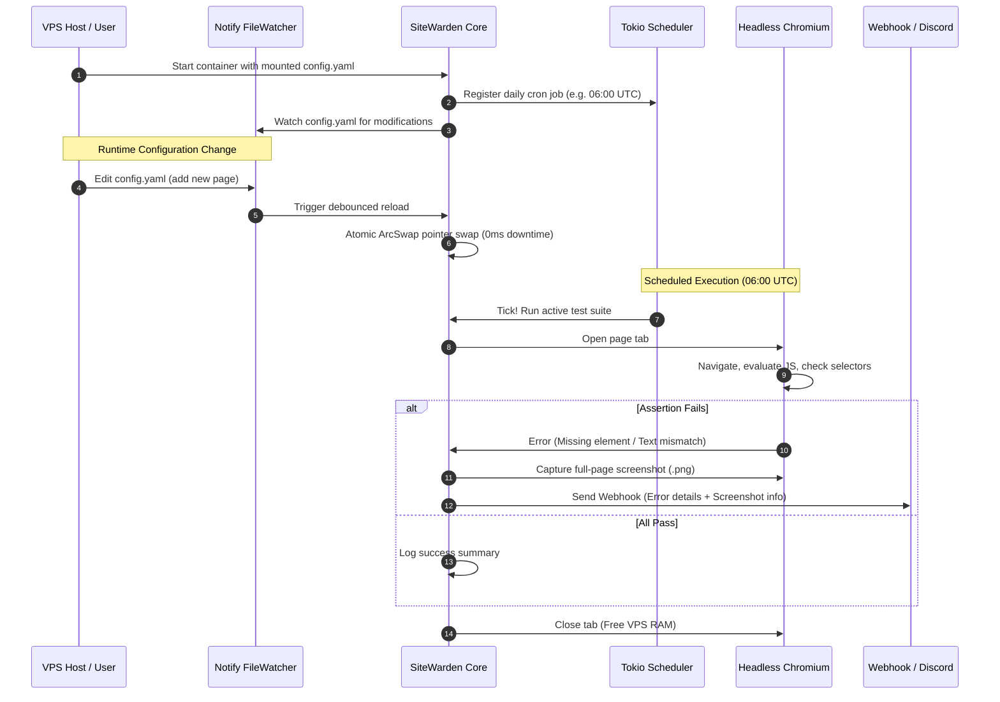

# Product Requirements Document (PRD)

**Project Name:** SiteWarden  
**Repository:** `github.com/<username>/sitewarden`  
**License:** Dual MIT / Apache-2.0  
**Status:** MVP Development  
**Target Environment:** Linux VPS (AWS EC2, Lightsail, DigitalOcean, Hetzner)  

---

## 1. Executive Summary & Vision

### 1.1 Vision
**SiteWarden** is an autonomous, ultra-lightweight, open-source browser smoke-testing sentinel written in Rust. It runs as a self-hosted daemon that wakes up on a defined schedule (e.g., daily at dawn), launches headless Chromium to navigate configured web applications and critical sub-pages, executes DOM-level assertions (rendering JavaScript, SPAs, clicking buttons, typing input, and verifying rendered text), and captures visual screenshot artifacts upon failure.

Crucially, SiteWarden is architected with **zero-downtime runtime configuration**: site targets, URLs, DOM assertions, and schedules can be modified on the fly without stopping the daemon, dropping background jobs, or recompiling code.

### 1.2 Value Proposition
* **Real Browser Accuracy:** Unlike simple curl/HTTP pingers, SiteWarden renders complete Single Page Applications (React, Vue, Svelte, Angular) using real Chromium via direct Chrome DevTools Protocol (CDP).
* **Minimal VPS Resource Footprint:** Built in async Rust (`tokio` + `chromiumoxide`). When idle between scheduled runs, memory usage is near zero (~15MB); during test execution with tab pooling, memory stays strictly capped (<250MB).
* **Zero-Downtime Hot Reloading:** Operations and test suites are defined declaratively in YAML and updated instantly at runtime via atomic memory swapping (`arc-swap` + `notify`).
* **Self-Contained Containerization:** Ships as a hardened multi-stage Docker container with all required Linux Chromium shared libraries, eliminating headless browser installation issues.
* **Continuous Self-Updating:** Seamless automated deployment via GitHub Actions and Watchtower.

---

## 2. Problem Statement

1. **Expensive Synthetic Monitoring:** Enterprise synthetic testing tools (Datadog Synthetics, Checkly, Pingdom) charge steep monthly fees per page check, which becomes cost-prohibitive for indie developers, startups, and agencies monitoring dozens of sub-pages.
2. **Heavyweight CI/CD Frameworks:** Running Node.js/Playwright/Cypress suites continuously on low-cost VPS servers consumes significant RAM (>1GB), suffers from memory leaks over time, and requires complex orchestration.
3. **Configuration Friction:** Modifying test targets in traditional test suites often requires a git commit, CI pipeline rebuild, and deployment cycle just to add a single new page check.
4. **Silent Production Failures:** Static HTTP status code checks (expecting `200 OK`) frequently pass even when client-side JavaScript crashes with a blank white screen. Real browser DOM verification is essential.

---

## 3. Goals & Key Performance Indicators (KPIs)

### 3.1 Primary Goals
- Provide a single-binary or single-container daemon that autonomously runs end-to-end smoke tests.
- Support hot-reloadable declarative test suites using standard YAML syntax.
- Deliver rich failure reports including full-page visual screenshots and webhook notifications.

### 3.2 Success Metrics / Target KPIs
| Metric | Target |
| :--- | :--- |
| **Idle Memory Usage** | < 25 MB RAM |
| **Active Test Memory** | < 250 MB RAM (with 2-3 concurrent tabs) |
| **Hot-Reload Latency** | < 500 ms from YAML save to in-memory active state |
| **Startup Time** | < 1.5 seconds to scheduler ready state |
| **Browser Zombie Process Rate** | 0% (Clean process reaping via `dumb-init`) |

---

## 4. User Personas & Core Use Cases

### 4.1 Personas
* **Alex, Solo SaaS Developer:** Manages 5 production web apps. Needs a daily 6:00 AM health check that verifies login forms, pricing pages, and dashboard cards without paying $50/mo for synthetic monitoring.
* **Priya, DevOps Engineer:** Deploys client web applications to AWS VPS instances. Needs a sentinel that can be updated dynamically via Ansible, Git pull, or SSH file edits without restarting the monitoring service.
* **Sam, QA Automation Specialist:** Wants a fast, declarative way to configure recurring smoke test suites across staging and production environments.

### 4.2 Core User Stories
1. *As a developer, I want SiteWarden to wake up every morning at 06:00 UTC, visit all my marketing and app URLs, and verify that critical UI elements are rendered.*
2. *As an engineer, I want to add a new landing page test to `config.yaml` on my VPS and have SiteWarden immediately recognize the new test without restarting the container.*
3. *As an on-call engineer, I want to receive an immediate webhook notification with a full-page screenshot when a test fails so I can visually diagnose the bug.*
4. *As an open-source contributor, I want a clean Rust codebase with high modularity and comprehensive test coverage.*

---

## 5. Feature Scope

### 5.1 In-Scope (Phase 1 - MVP)
- [x] **Headless Chromium Automation:** Direct CDP communication via `chromiumoxide`.
- [x] **Declarative Step Engine:** Support for `navigate`, `wait_for_selector`, `assert_text`, `assert_visible`, `click`, `type_text`.
- [x] **Cron-Based Scheduling:** Configurable cron expressions (e.g. daily, hourly).
- [x] **Hot-Reload Configuration:** Inotify-based file watcher swapping config in-memory using `ArcSwap`.
- [x] **Failure Artifacts:** Automatic full-page PNG screenshot generation saved to mounted volume.
- [x] **Alerting Dispatcher:** Discord, Slack, and generic JSON Webhook notifications on failure.
- [x] **Docker & CI/CD Packaging:** Multi-stage `Dockerfile`, GitHub Actions workflow building to `ghcr.io`, and auto-update via Watchtower.

### 5.2 Future Scope (Phase 2 & Roadmap)
- [ ] **SSL Certificate Expiry Monitor:** Proactive alerts 14 days before certificate expiration.
- [ ] **Embedded Web Admin UI:** Lightweight `axum` web dashboard to view historical runs and edit tests via browser.
- [ ] **Performance & SLA Metrics:** Response times, Largest Contentful Paint (LCP), and Prometheus metrics export.
- [ ] **Multi-Channel Alerts:** Direct Telegram bot and SMTP email integration.
- [ ] **HAR Recording & Network Tracing:** Export network traffic logs on failure.

---

## 6. Functional Architecture & System Flow

---

## 7. Non-Functional Requirements (NFRs)

* **Safety & Concurrency:** 100% memory-safe Rust with zero `unsafe` code blocks in application logic.
* **Resilience:** Uncaught exceptions, page crashes, or network timeouts must never crash the parent daemon process.
* **Resource Optimization:** Strict browser page recycling to avoid Chromium memory leaks.
* **Portability:** Containerized execution compatible with any x86_64 or ARM64 Linux host supporting Docker.
